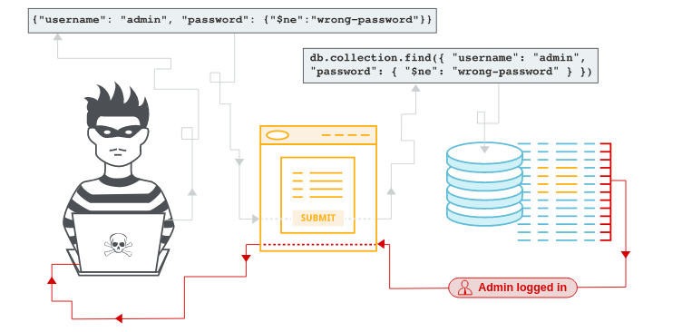

# NoSQL 

Es una vulneravilidad en la que un atacante puede interferir entre las consultad de una aplicación con la base de datos. Los ataques pueden ser:

- Omitir mecanismos de autenticación o protección.
- Extraer o editar datos.
- Causar una denegación de servicio.
- Ejecutar código en el servidor.

Las bases de datos NoSQL almacenan y recuperan datos en un formato distinto a las tablas relacionales SQL tradicionales. Utilizan una amplia gama de lenguajes de consulta en lugar de un estándar universal como SQL y tienen menos restricciones relacionales.

- Inyección de sintaxis: esto ocurre cuando puedes romper la sintaxis de la consulta NoSQL, lo que te permite inyectar tu propia carga útil. La metodología es similar a la utilizada en la inyección SQL. Sin embargo, la naturaleza del ataque varía significativamente, ya que las bases de datos NoSQL utilizan una variedad de lenguajes de consulta, tipos de sintaxis de consulta y diferentes estructuras de datos.

- Inyección de operador: esto ocurre cuando puede utilizar operadores de consulta NoSQL para manipular consultas.

