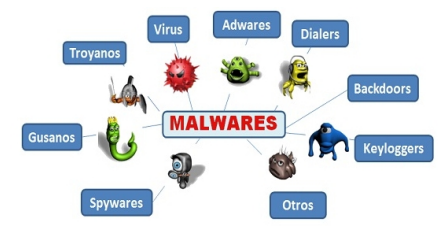

# Tipos de seguridad

- Seguridad física: todo lo referido a los dispositivos.
- Seguridad lógica: todo lo referido a el software.
- Seguridad pasiva: mecanismos para recuperarnos despues de un ataque.
- Seguridad activa: mecanismos de proteccion en tiempo real.

Según la ciberseguridad

- Defensiva: Implementacion de politicas y estrategias para garantizar la seguridad de la información.
- Ofensiva: Medir los niveles de seguridad de nuestros activos , mediante el uso de tecnicas de intrusion y creando un informe a partir de los resultados.

# Amenazas

**Toda acción que aprovecha una vulnerabilidad** para atentar contra laseguridad de un activo de información.

tipos:

- Internas: originadas dentro de la organización.
- Externas: provenientes fuera de la organización.
- Desastres naturales: Buena ubicación de los CPD
- Robos: protección del acceso de los CPD
- Fallosde suministro: de energía o internet, uso de segundas conexiones.
- Malware: Software no deseado que puede comprometer los activos de información.
- Ataques de codigo fuente: Defectos en el codigo base.
- Ataques a la configuración por defecto: vulnerabilidades de los sistemas operativos.

## Vulnerabilidades

Es cualquier tipo de defecto o debilidad en el software, hardware, o activo de información, que puede ser aprovechado por ciberatacante.

tipos:

- Hardware
- Software

exploits: software diseñado para aprovecharse de vulnerabilidades conocidas de un sistema.

# Malware

Software diseñado para dañar o interrumpir un activo de información, sin concentimiento previo.

| Malware | Descripción |
| --- | --- |
| Virus | Codigo malintencionado que se adjunta a archivos ejecutables, requiere la activación del usuario. |
| Troyano | Malware que tiene la apariencia de una aplicación valida. |
| Gusano | Malware que se replica de forma automatica atraves de la red. |
| Spyware | Malware que rastrea y espia al usuario. ej: Keylogger. |
| Adware | Software que muestra publicidad automaticamente. |
| Scarware | Malware que simula alertas falsas en forma de ventanas emergentes aparentemente legitimas de los S.O. con el objetivo de asustar al usuario y que realize acciones precipitadas. |
| Rootkit | Malware que modifica el S.O. para crear puertas traseras que otorgan un acceso remoto no concentido. |
| Bot | Malware que realiza acciones automaticas en linea. |
| Rasomware | Malware que encripta datos de una computadora con una clave desconocida para pedir un rescate. |

## Suplantación de identidad o phishing

Conocido como phishing, es una forma de fraude, donde los ciberdelincuentes intentan recopilar información disfrazándose como una entidad o persona de confianza. (emails, mensajería, redes sociales).

| Tipos de phishing | Descripción |
| --- | --- |
| Vishing | Mediante la tecnología de voz (llamadas). |
| Smishing | Mediante mensajeria de texto (mensajes de texto). |
| Pharming | Mediante sitios web falsos que parecen ser oficiales (envenenamiento DNS en algunos casos) |
| whaling |  Objetivos de alto nivel como ejecutivos. |

## Envenenamiento

| Tipo de envenenamiento | Descripción |
| --- | --- |
| Complementos | colapso de sistemas complemento como Flash Player o WordPRess |
| SEO | Utiliza SEO para dar mayor visibilidad a sitios web maliciosos o falsos |

## Ataques a la red

| Tipo de ataque | Descripción |
| --- | --- |
| DoS(Denegación de servicio) | Interrumpir los servicios de un sistema a traves del envio de masivas solicitudes que colapsan el sistema. |
| DDoS(Denegacion de servicio distribuido) | Es un Dos pero con multiples fuentes  |

- Sniffing: Examinar el trafico de una red a traves de captura de paquetes en un nodo.
- Hombre en el medio MITM: Se intercepta y analiza información para luego retransmitirla a su destino

![]https://varutra-1a3b6.kxcdn.com/wp-content/webp-express/webp-images/uploads/2023/06/what-is-a-sniffing-attack_updated.png.webp

## Ataques a redes moviles

- Grayware: Malware que incluye App que se comportan de manera molesta, ej: activavion de la ubicacion sin permiso.
- Bluesnarfing: Toma de control a traves de Bluetooth.
- SIMSwapping: duplicación del número de telefono, parasuplantar la identidad del afectado.

## Ataques a aplicaciones y BD

- XSS (Scripting entre sitios): Inyección de scripts maliciosos a paginas web, que los usuarios pueden ver y acceder. Tienen sus tipos y son:
    - Persistente
    
    La inyección del script se almacena en el servidor. 
    
    Cuando un usuario visita el sitio web, el script se activa.
    
    
    
    - Reflejado
    
    El script forma parte de la petición y respuesta de la victima.
    
    El perpetrador envia el script, el usuario visita la pagina petición y el script se ejecuta en el navegador del usuario.
    
    
    
    - Local
    
    El script unicamente se ejecuta en el navegador del usuario.
    
    El atacante envia una URL contaminada al usuario, el usuario abre el link y envia una solicitud al sitio web, el sitio web responde pero no incluye un malware malicioso, cuando llega el script se ejeccuta y envia datos al atacante.
    
    
    
- SQL injection: Inserción de declaraciones SQL maliciosas.

- NoSQL injection: Insercion de declaraciones NoSQL maliciosas.

## Otros tipos de ataque

- ingenieria social:  manipulación de las personas.
- Stalker:  acosador por internet.
- Grooming: acosador a menores de edad por internet.
- Ataques de fuerza bruta: atraves del uso de diccionarios, adivinar la contraseña.
- Hijacking: secuestro de algo (conexiones de red, sesiones, servicios, etc).
- Ataques del dia cero: Explotar vulnerabilidades desconocidas hasta el momento.
    - Amenazas persistentes avanzadas (APT): Un conjunto de procesos informáticos sigilosos, continuos y a largo plazo, a menudo orquestados por humanos, dirigidos a penetrar la seguridad informática de una entidad específica.

## Quién reduce el impacto ? 🤔

Responsable de T.I. que se encargara

- Identificar los activos que hay que proteger
- Revisar la política de copias de seguridad
- Redactar y revisar regularmente los planes de actuación ante catástrofes
- No instalar nada que no sea estrictamente necesario
- Estar al día de todos los informes de seguridad que aparezcan
- Dar formación a los usuarios
- Revisar los log del sistema
- Revisar la lista de equipos conectados
- Revisar la lista de usuarios activos