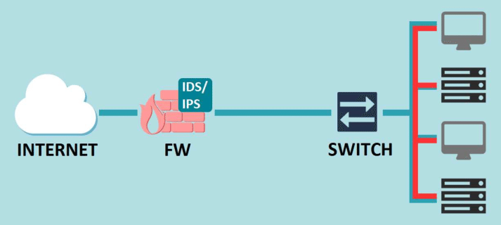
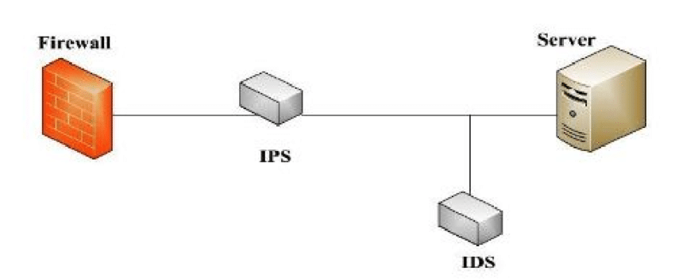

# IDS (Intrusion Detection System) - IPS (Intrusion Prevention System)

Sistema de deteción de intrusos, es una **herramienta de monitoreo del trafico de red**, monitorea el trafico de la red en busca de anomalias que pueden ser un peligro potencial detectando malware, ataques e intrusiones del sistema, en comparación el sistema de prevención de intrusos detecta anomalias o se basa en las detectadas por el IDP para realizar acciones automaticas programadas.

### Acción ante una amenaza:

IDS: Alerta a los administradores de seguridad sobre la actividad sospechosa para que tomen las medidas correctivas.
IPS: Puede tomar acciones automáticas para detener la intrusión, como bloquear la dirección IP del atacante, cerrar puertos vulnerables o detener el proceso malicioso.

### Tecnología utilizada:

IDS: Analiza el tráfico de la red o la actividad del sistema comparándolo con patrones predefinidos (firmas) o buscando anomalías.
IPS: Además de las técnicas del IDS, puede utilizar mecanismos como listas negras de direcciones IP maliciosas o firewalls de aplicaciones web para bloquear el tráfico no deseado.

### Clasificaciones

### NIPS/NIDS

Se puede implementar en un dispositivo exclusivo o no exclusivo en la red para detectección, pero se debe **colocar las interfaces monitoreadas en modo promiscuo** para escuchar el trafico del segmento de red.

### HIPS

Software instalado en un host para controlar y analizar actividades sospechosas.

### Reglas

| Acción           | Protocolo                 | Red origen | Puerto origen | Dirección | Red destino | Puerto destino |
| ---------------- | ------------------------- | ---------- | ------------- | --------- | ----------- | -------------- |
| alert, log, pass | tcp, udp, ip , icmp e arp |            |               |           |             |                |
|                  |                           |            |               |           |             |                |

### Salida

Las salidas pueden ser tratados por:

- Syslog:
- DataBase:
- Eventlog:

**Se debe coloar** las herramientas de monitoreo despues del firewall para evitar falsos positivos.
