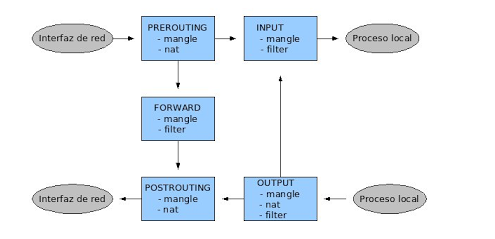
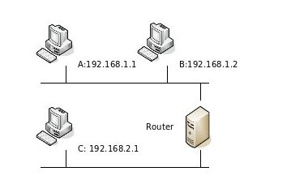
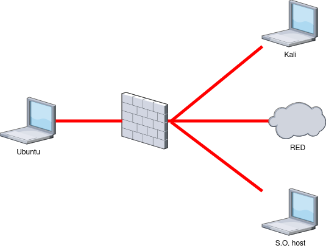

# Netfilter

Es una infraestructura que opera en el kernel de linux, diseñada para manipular y controlar el trafico de internet.
Tanto Iptables y nftables se basan en la infraestructura de netfilter.

# IPtables

IPtables es una herramienta de línea de comandos diseñada para configurar reglas de firewall de manera sencilla y eficaz. Permite la filtración de paquetes, la traducción de direcciones de red y la modificación del encabezado de los paquetes. Dos de sus usos más comunes son dar soporte para cortafuegos (firewalls) y NAT (Network Address Translation).

Configurar IPtables manualmente puede ser un desafío para aquellos que están comenzando. Afortunadamente, existen algunas herramientas de configuración (asistentes) disponibles para ayudar en este proceso, como ufw (Uncomplicated Firewall), utilizado en distribuciones como Ubuntu.

## Instalación IPtables

```bash
# instalar iptables
# actualizar el indice de paquetes
$ sudo apt update
# instalar la herramienta para IPv4
$ sudo apt install iptables
# instalar la herramienta para IPv6
$ sudo apt install ip6tables
# instalar la herramienta para ARP
$ sudo apt install arptables
# instalar la herramienta para Ethernet
$ sudo apt ebtables
# verificar la version del conjunto de herramientas instaladas
$ iptables --version
$ ip6tables --version
$ arptables --version
$ ebtables --version
```

## Estructura de iptables

- Existen diferentes tablas (tables) dentro de las cuales puede haber varias cadenas (chains).
- Cada cadena consiste en una lista de reglas con las que se comparan los paquetes que pasan por el cortafuegos. Las **reglas especifican qué se hace con los paquetes que se ajustan a ellas** (target == acción que se ejecuta cuando un paquete se ajusta a una regla).

Para cada paquete que recibe el cortafuegos, se examina la primera regla de la cadena correspondiente. Si el paquete no se ajusta a esa regla, se continúa examinando la siguiente hasta que se ajusta con alguna. En ese momento se ejecuta el target, los targets o acciones pueden ser 2:

1. DROP: descartar paquete.
2. ACCEPT: paquete continue su camino.

## tablas

En iptables existen tablas preinstaladas que son:

- filter: es la tabla por defecto y se utiliza para filtros de paquetes, con 3 cadenas predefinidas:

1. INPUT: para los paquetes que van dirigidos al cortafuegos.
2. FORWARD: paquetes enrutados que vienen de un destino remoto a nuestro equipo.
3. OUTPUT: paquetes generados localmente y que deben salir.
4. PREROUTING: Modifica paquetes antes de ser enrutados. Se utiliza para tareas como el enmascaramiento de IP y la configuración de NAT.
5. POSTROUTING: Modifica los paquetes justo antes de abandonar el sistema. Permite realizar tareas como el marcado de paquetes y la configuración de QoS.

- nat: Se utiliza para configurar opeaciones de traduccion NAT y modificacion de puertos de trafico, con 3 cadenas:

1. prerouting: paquetes antes de entrar al enrutado
2. output: paquetes generados localmente por el sistema donde se configuro la tabla nat
3. postrouting: paquetes que estan a punto de salir.

- La tabla mangle es una tabla especial, destinada a alterar determinados parámetros de los paquetes (TOS, TTL …), que se utiliza para realizar configuraciones complejas del cortafuegos. Cuenta con 5 chains predefinidas: INPUT, OUTPUT, PREROUNTING, POSTROUTING Y FORWARD.



Veamos el camino que seguiría, por ejemplo, un paquete que se origina en nuestra red local y va destinado a una máquina de Internet:

- El paquete entra en el cortafuegos por una interfaz de red, por tanto, primero se comprobarían las reglas de la cadena PREROUTING.
- A continuación se comprobarían las reglas de la cadena FORWARD, ya que el paquete no va destinado a un proceso del cortafuegos, si no que va a atravesarlo, saliendo por la interfaz que lo conecta con la red externa.
- Por último, si el paquete no ha sido filtrado y sigue adelante, antes de salir del cortafuegos por la otra interfaz de red, se comprueban las reglas de la cadena POSTROUTING

### Listado de reglas

```bash
# Estructura:
$ iptables [-t tabla] -[opciones] [chain/regla]

# Muestra un listado de todas las reglas de una cadena, o de todas ellas. Las opciones disponibles son:

#    -v: información detallada de una regla
#    -N: crear una nueva cadena
#    -X: Borrar una cadena vacía
```

### Borrado de contadores:

Cuenta cuantas veces una regla ha coincidido con un paquete.

```bash
iptables [-t tabla] -Z [chain]
```

Borra los contadores de una determinada chain, o de todas ellas. Es habitual colocar este comando al principio de todos los script de configuración, para borrar las reglas que existieran de antemano. Se puede combinar con la opción -L para mostrar la información justo antes de borrarla.

### Borrado de todas las reglas:

```bash
iptables [-t tabla] -F [chain]
```

Borra las reglas de una determinada chain o de todas ellas.

### Creación y borrado de reglas:

```bash
$ iptables [-t table] -A chain rule-spec
$ iptables [-t table] -I chain [rulenum] rule-spec
$ iptables [-t table] -R chain rulenum rule-spec
# elimina especificando las reglas a eliminar en [rule-spec]
$ iptables [-t table] -D chain rule-spec
# elimina la regla con el numero (rulenum) especificado.
$ iptables [-t table] -D chain rulenum
```

**Las opciones son las siguientes:**

    -A: añade una regla al final de la lista
    -I: inserta una regla al comienzo de la lista o en el punto especificado
    -R: reemplaza una regla (especificada por su número de regla) por otra
    -D: borra una regla determinada
    -P: politica por defecto

## Para especificar una regla podemos usar los siguientes parámetros:

    -p [!] protocolo: el protocolo del paquete a comprobar. Puede ser ‘tcp’, ‘udp’, ‘icmp’ o ‘all’
    -[sd] [!] dirección[/máscara]: dirección ip origen (s) o destino (d) del paquete
    -[io] [!] iface: nombre de la interfaz de entrada (i) o de salida (o) del paquete
    -j target(acción): especifica el target de dicha regla. Puede ser una acción predefinida (ACCEPT, DROP), una extensión o el nombre de una chain

## Establecimiento de un política por defecto:

iptables [-t table] -P chain target

Establece el taget que se ejecutará para los paquetes que no cumplan con ninguna regla de la chain especificada.

## Ejemplo sencillo:



Supongamos que queremos que sólo la máquina B pueda hablar con C, y además sólo pueda usar el protocolo TCP. Los paquetes que no cumplan estas condiciones serán descartados. Lo primero que tenemos que decidir es ¿en qué tabla y en qué cadena vamos a colocar las reglas? En este caso, queremos realizar filtrado de paquetes, por lo que está claro que trabajaremos con la tabla filter, pero ¿en la cadena INPUT, OUTPUT o FORWARD? Como los paquetes que queremos filtrar son los que van a atravesar el Firewall de una red a otra, trabajaremos con la cadena FORWARD. Los comandos que deberíamos usar para conseguir estos objetivos son los siguientes:

```bash
# borra las reglas que pudiera haber en la cadena FORWARD de la tabla filter (que es la tabla por defecto).
$ iptables -F FORWARD
# establece la política por defecto a DROP (denegar), por lo tanto, los paquetes que no cumplan con las reglas que especifiquemos serán rechazados.
$ iptables -P FORWARD DROP
# permiten el tráfico entre las máquinas B y C según las reglas especificadas en el enunciado.
$ iptables -t filter -A FORWARD -p tcp -s 192.168.1.2 -d 192.168.2.1 -j ACCEPT
$ iptables -t filter -A FORWARD -p tcp -s 192.168.2.1 -d 192.168.1.2 -j ACCEPT
```


**Es mas comodo usar scripts que ejecutar reglas uno a uno**

# NFtables

NFtables reemplaza a las populares {ip,ip6,arp,eb}tables. Este software proporciona un nuevo marco de clasificación de paquetes en el kernel, que se basa en una máquina virtual (VM) específica de la red y una nueva herramienta de línea de comandos de espacio de usuario llamada nft.

NFtables reutiliza los subsistemas de Netfilter existentes, como la infraestructura de enlace, el sistema de seguimiento de conexiones, NAT, colas de espacio de usuario y el subsistema de registro. En NFtables, las tablas y cadenas son totalmente configurables, no hay tablas predefinidas que siempre deban estar presentes (como sí ocurre con IPtables). Los nombres de estas tablas y cadenas pueden ser arbitrarios.

## Instalación de NFtables

```bash
# actualizar el indice de paquetes
$ sudo apt update
# instalar nftables
$ sudo apt install nftables
# verificar la instalación
$ nft --version
# reiniciar el servicio nftables
$ systemctl restart nftables.service
```

## Estructura de los scripts NFtables


### Ejercicios

### Objetivo:

Aprender la sintaxis basica de iptables y nftables utilizando protocolos ssh e icmp y las ips.

### Ecenario 1 : acceso en una LAN

Supongamos que la máquina host debe conectarse a la máquina Ubuntu por medio del protocolo ssh, y además la máquina kali debe tener únicamente conexión ICMP (ping) con la máquina Ubuntu, y todo el resto de tráfico que provenga de cualquier otro dispositivo debe ser descartado.

Crear un script y darle los permisos adecuados de ejecución chmod +x archivo.sh, poseriormente darle rellenarlo con los siguientes scripts




Llene estos campos usted mismo seran necesarios

| dispositivo | dirección ip |
| ----------- | ------------ |
|             |              |
|             |              |
|             |              |

Pasos:

1. Acceder al sistema ubuntu con sus credenciales correspondientes, entrar a la terminal, acceder como usuario privilegiado con el comando su, entrar al directorio /tmp, crear el directorio my-scripts y crear un archivo iptables1.sh

```bash
$ su
$ cd /tmp
$ mkdir my-scripts
$ cd my-scipts
$ nano iptables1.sh
```

2. Colocar el siguiente script, omitir los comentarios pero leerlos que son relevantes para entender el funcionamiento de estas reglas y guardar el archivo.

### iptables

```bash
#!/bin/bash
## Script de iptables – Un ejemplo sencillo

## Borramos las reglas de la cadena INPUT de la tabla por defecto filter que se hayan configurado previamente para no tener conflictos
iptables -F INPUT

## Establecemos la política por defecto -> DROP, una regla general que se aplica cuando un paquete no cumple con las
## condiciones de ninguna regla especifica
## flags :
## P == policy (politica), F == flush (vaciar)
iptables -P INPUT DROP

## Aceptamos el trafico ssh de la maquina host
## flags:
## A == add (agregar regla), INPUT == tabla predefinida de entrada, p == protocol, s == source y j ==jump (accion a
## realizar cuando se cumpla la condición)
iptables -t filter -A INPUT -p tcp --dport 22 -s 192.168.0.8 -j ACCEPT

## el trafico icmp de la maquina kali
iptables -t filter -A INPUT -p icmp -s 192.168.0.18 -j ACCEPT

## Las 2 reglas anteriores con la accion de aceptar son ambas especificas.

## no es necesario colocar -t filter para especificar la tabla porque filter es la tabla por defecto que se usa.

```

3. Darle los permisos de ejecución al script.

```bash
$ chmod +x iptables.sh
```

4. Entrar a la máquina kali y probar que existe tráfico icmp y ssh (colocar las credenciales del usuario) en el puerto 22 para el acceso a ubuntu.

```bash
kali$ ping [ip ubuntu]
kali$ ssh [usename]@[ip ubuntu]
```

5. Probar lo mismo con la máquina host

```bash
host$ ping [ip ubuntu]
host$ ssh [usename]@[ip ubuntu]
```

Despues de probar ejecutar:

```bash
## Eliminamos las reglas de entrada para volver al estado normal ejecutando lo siguiente
## Este comando eliminará las reglas de entrada configuradas anteriormente y posteriormente aceptará los todo el tráfico
## que es una regla por defecto.
$ iptables -F
$ iptables -P INPUT ACCEPT
```

### nftables
Es una herramienta más moderna que iptables, realizando las mismas funciones, con la diferencia de que tiene una sintaxis más amigable y no requiere de tablas y cadenas de reglas predefinidas, nosotros creamos las tablas y cadenas a usar.

Se realizaran los siguientes pasos:

1. Primero accedemos como usuario privilegiado con el comando "su", creamos la tabla donde tendremos las configuraciones con el siguiente comando:

```bash
$ su
$ nft add table ip icmp_filter
```

2. Verificar creación y estructura de la tabla creada:

```bash
$ nft list ruleset
```

3. Agregamos la cadena donde configuraremos las reglas

```bash
$ nft add chain ip icmp_filter INPUT ‘{type filter hook input priority 0; policy drop;}’
```
Explicación: 
type filter: Indica que la cadena se utilizará para filtrar paquetes según las reglas que establezcas.
hook input: Indica que la cadena estará conectada al punto de enganche de entrada, lo que significa que manejará los paquetes que ingresan al sistema.
priority 0: Establece la prioridad de la cadena. Una prioridad de 0 indica que esta cadena se procesa antes que otras cadenas con una prioridad mayor.
policy drop: Establece la política predeterminada de la cadena. En este caso, la política predeterminada es "drop", lo que significa que por defecto se descartarán todos los paquetes que no coincidan con reglas específicas en la cadena.

4. 


```bash
#!/usr/sbin/nft -f

table ip filter {
    chain input {
        # Borramos las reglas de la cadena INPUT de la tabla por defecto filter que se hayan configurado previamente para no tener conflictos
        type filter hook input priority 0;
        delete
    }

    # Establecemos la política por defecto -> DROP, una regla general que se aplica cuando un paquete no cumple con las condiciones
    # de ninguna regla especifica
    chain input {
        type filter hook input priority 0;
        policy drop;
    }

    # Aceptamos el tráfico ssh de la máquina host
    chain input {
        type filter hook input priority 0;
        ip protocol tcp tcp dport 22 ip saddr 192.168.0.8 accept;
    }

    # El tráfico ICMP de la máquina kali
    chain input {
        type filter hook input priority 0;
        ip protocol icmp ip saddr 192.168.0.18 accept;
    }
}

```

### Objetivo:

Poner en ejecucion un ejemplo para controlar el trafico con la familia de protocolos TCP y ARP.

### Escenario 2 : Entorno escolar

En un entorno educativo deseamos que los estudiantes solo tengan acceso a noticias oficiales para la materia de civica, por lo que el acceso a cualquier tipo de sitios web no es permitido, y ademas controlar el acceso a partir de las direcciones MAC para el acceso remoto al dispositivo de los estudiantes.

Script ejecutados en el firewall host

```bash
#!/bin/bash
## Script de iptables – Bloqueo de acceso a ciertos sitios web con reglas permitidas
## Borramos las reglas de la cadena OUTPUT de la tabla por defecto filter para no tener conflictos
iptables -F OUTPUT
arptables -F INPUT
## Establecemos la política por defecto de la cadena OUTPUT a ACCEPT
iptables -P OUTPUT ACCEPT
arptables -P INPUT DROP
## Permitimos el tráfico a las direcciones IP permitidas
## www.lostiempos.com
iptables -A OUTPUT -d 45.79.163.254 -j ACCEPT
## elpotosi.net
iptables -A OUTPUT -d 104.21.61.194 -j ACCEPT
iptables -A OUTPUT -d 172.67.213.89 -j ACCEPT
## eldeber.com.bo
iptables -A OUTPUT -d 104.22.75.193 -j ACCEPT
iptables -A OUTPUT -d 172.67.20.27 -j ACCEPT
## freeditorial.com
iptables -A OUTPUT -d 104.22.74.193 -j ACCEPT
iptables -A OUTPUT -d 37.59.238.221 -j ACCEPT
## lista de direcciones mac con acceso permitido
arptables -A INPUT --source-mac 12:34:56:78:90:00 -j ACCEPT
arptables -A INPUT --source-mac 99:88:77:66:55:44 -j ACCEPT
arptables -A INPUT --source-mac 40:50:60:70:80:90 -j ACCEPT
arptables -A INPUT --source-mac 00:ac:e0:b9:ce:d7 -j ACCEPT
arptables -A INPUT --source-mac 94:65:9c:6a:4e:c9 -j ACCEPT
## Bloqueamos el tráfico a los puertos HTTP/HTTPS para todas las demás direcciones IP
iptables -A OUTPUT -p tcp --dport 80 -j DROP
iptables -A OUTPUT -p tcp --dport 443 -j DROP
iptables -A INPUT -p tcp --dport 80 -j DROP
iptables -A INPUT -p tcp --dport 443 -j DROP
iptables -A FORWARD -p tcp --dport 80 -j DROP
iptables -A FORWARD -p tcp --dport 443 -j DROP


```


Scripts ejecutados en otra maquina que simulara ser varias a la vez

MAC changer 

```bash
# ver las direcciones MAC actuales de una interfaz
$ macchanger -s [interfaz]
# current(temporal) MAC
# permanent(permanente) MAC

# cambiar mac de forma aleatorio
$ macchanger -r [interfaz]

# restaurar mi direccion MAC
$ macchanger -p [interfaz]

# asignar dirección mac de forma manual
$ macchanger -m [DIR-MAC] [interfaz]

```
