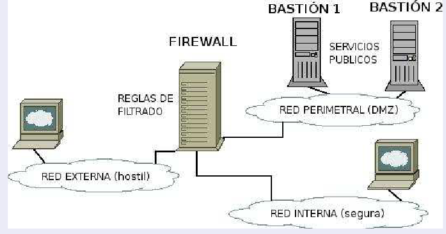

# Firewall

Es un dispositivo hardware o producto software de seguridad de la red que monitorea el tráfico de red **entrante y saliente** y decide si **permite o bloquea** el tráfico específico en función de un conjunto definido de reglas de seguridad. Establecen una barrera entre las redes internas protegidas, controladas en las que se puede confiar y redes externas que no son de confianza, como Internet. 

El cortafuegos se configura con una serie de reglas que determinan el tráfico que puede pasar de una red a otra y el tráfico que debe ser bloqueado. Para comprender el funcionamiento de un cortafuegos, podemos pensar en cómo desempeñan su trabajo los guardias de seguridad de una discoteca. Los dueños del local establecen los criterios que debe cumplir un potencial cliente para poder pasar a la sala y, cada vez que alguien llega a la puerta, el portero lo evalúa:

Para cada paquete que recibe el cortafuegos, se examina la primera regla de la cadena correspondiente. Si el paquete no se ajusta a esa regla, se continúa examinando la siguiente hasta que se ajusta con alguna. En ese momento se ejecuta el target(acción):

    DROP: el paquete se descarta, no puede pasar
    ACCEPT: el paquete continúa su camino normal

Si se llega al final de una cadena predefinida se ejecuta un **target por defecto, llamado chain policy**. El chain policy establece, por tanto, la política por defecto de nuestro cortafuegos.
    si cumple los criterios → pasa
    si no los cumple → no pasa

Para cada paquete que recibe el cortafuegos, se examina la primera regla de la cadena correspondiente. Si el paquete no se ajusta a esa regla, se continúa examinando la siguiente hasta que se ajusta con alguna. En ese momento se ejecuta el target:

    DROP: el paquete se descarta, no puede pasar
    ACCEPT: el paquete continúa su camino normal

Si se llega al final de una cadena predefinida se ejecuta un target por defecto, llamado chain policy. El chain policy establece, por tanto, la política por defecto de nuestro cortafuegos.

## Tipos de firewalls
 
1. Firewall de host o de software: software instalados en servidores o PC.
2. Firewall de red o de hardware: dispositivos con software dedicado al fitrado de la red son instalados en lugares estrategicos de la red.

## Metodos de filtracion de trafico

Se puede clasificar a los firewalls como :

- Firewall proxy: Realiza un filtrado de paquetes completo.
- Firewall de inispección de estado: Realiza filtrado de paquetes de acuerdo al aprendizaje de eventos previos. Asi, por ejemplo; podría bloquear un tipo de tráfico que causó problemas anteriormente, o incluso bloquear ataques de fuentes de las cuales ya han sido catalogadas como maliciosas.
- Firewall de proxima generacion: Es una combinacion de ambos, revisan el trafico y toman decisiones.

## Cómo funcionan las reglas de los firewalls

Los firewalls procesan la reglas configuradas de arriba a abajo, las reglas determinan la acción del firewall sobre los paquetes y se basan en los protocolos de red, IP, TCP/UDP, ICMP, etc.

  

## Prácticas recomendadas

**Colocar las reglas en los grupos de reglas desde la mas especifica a la general.**

Por ejemplo, para permitir todas las solicitudes HTTP excepto desde una dirección específica (por ejemplo, la dirección IP 10.10.10.1), cree dos reglas:

> Regla Bloquear: bloquea el tráfico HTTP de la dirección IP 10.10.10.1. Esta regla es específica.

> Regla Permitir: permite todo el tráfico utilizando el servicio HTTP. Esta regla es general.

Coloque la regla Bloquear en un nivel superior en la lista de reglas del firewall que la regla Permitir. Cuando el firewall intercepta la solicitud HTTP desde la dirección 10.10.10.1, la primera regla coincidente que encuentra es la que bloquea este tráfico a través del firewall.

Si la regla Permitir general es superior que la regla Bloquear específica, Firewall concuerda las solicitudes con la regla Permitir antes de encontrar la regla Bloquear. Permite el tráfico, a pesar de que quisiera bloquear la solicitud HTTP de la dirección específica 10.10.10.1. 

Existen hardware y software diseñados especificamente para realizar funciones de filtrado y enrutado de paquetes, como :
- Software: PFsense, IPcop, IPfire, etc.
- Hardware: Cisco, Juniper, Fortinet.

## Funcionalidades principales de un firewall
son: 
- Portal cautivo (Cuando un usuario intenta acceder a una red el firewall redirecciona la solicitud a una web(portal cautivo) donde se pide las credenciales y en base a la respuesta permite o deniega la solicitud)
- Filtrado web.
- Limitar ancho de banda.
- Bloquear descargas.

## ¿Donde se colocan los firewall de red?

Se tienen los siguientes esquemas: 

1. Con un firewall, un perimetro de seguridad y una red interna local segura.

2. Con 2 firewalls

## Ejercicios: 

# Exercise: Creating iptables rules

# Flush existing rules and chains
iptables -F
iptables -X

# Set default policies
iptables -P INPUT DROP
iptables -P FORWARD DROP
iptables -P OUTPUT ACCEPT

# Allow loopback traffic
iptables -A INPUT -i lo -j ACCEPT
iptables -A OUTPUT -o lo -j ACCEPT

# Allow established and related connections
iptables -A INPUT -m conntrack --ctstate ESTABLISHED,RELATED -j ACCEPT

# Allow SSH connections from a specific IP address
iptables -A INPUT -p tcp -s 192.168.0.100 --dport 22 -j ACCEPT

# Allow HTTP and HTTPS traffic
iptables -A INPUT -p tcp --dport 80 -j ACCEPT
iptables -A INPUT -p tcp --dport 443 -j ACCEPT

# Allow DNS traffic
iptables -A INPUT -p udp --dport 53 -j ACCEPT

# Allow ICMP (ping) requests
iptables -A INPUT -p icmp --icmp-type 8 -j ACCEPT

# Log and drop all other incoming traffic
iptables -A INPUT -j LOG --log-prefix "Dropped: "
iptables -A INPUT -j DROP

