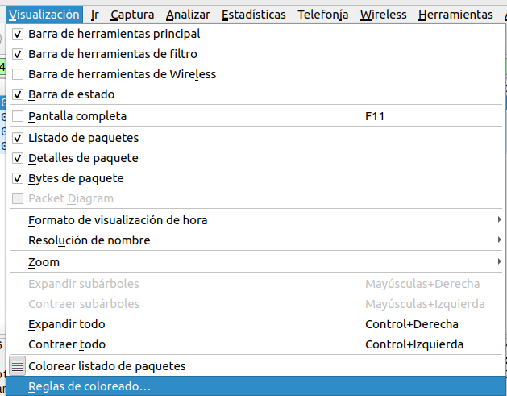
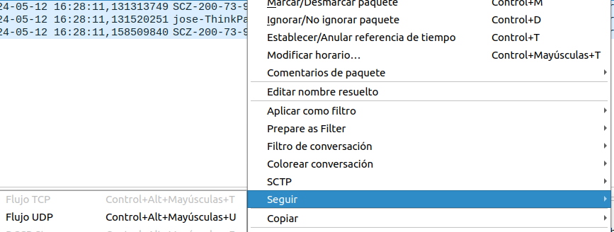
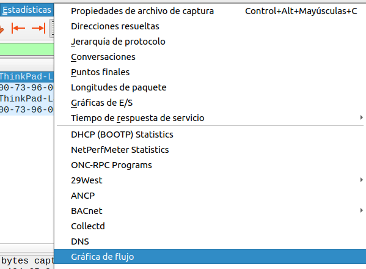
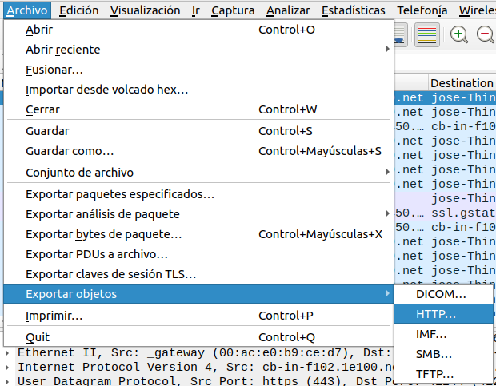
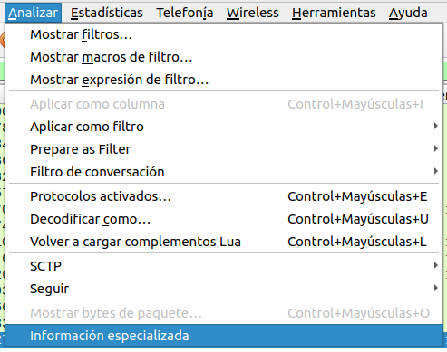
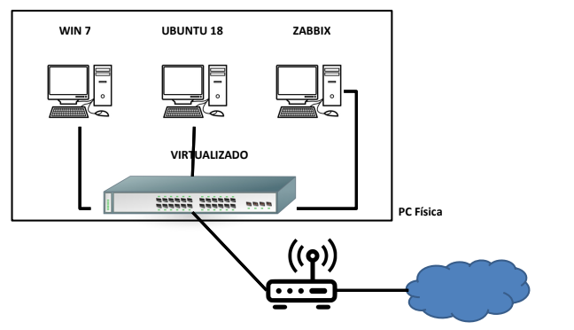

# Monitoring

## Servidores NTP (Network Time Protocol)

Es un protocolo que se utiliza para sincronizar relojes de sistema informaticos.

Estratos:

1. Estrato 0: dispositivos con relojes de alta precisión como relojes atómicos.
2. Estrato 1: Se encuentran directamente conectados a dispositivos de estrato 0 y estan sincronizados con una latencia de unos pocos microsegundos de un dispoditivo de estrato 0.
3. Estrato 3: Sincronizado por una red de datos con servidores de estrato 1 utilizando paquetes NTP.

## Wireshark

Analizador del trafico de internet por medio de la captura los paquetes recibidos y los enviados desde una interfaz. Esta herramienta es util para:

- Solucionar problemas de red como latencia, perdida de paquetes o errores de enrutemiento.
- Analizar el trafico de red.
- Aprender de protocolos.

## Wireshark Practico

## Filtros basicos

## Opciones

- Visualización por colores

  Entrar a View > coloring rules y especificar los colores para cada filtro.

  

- Seguir un flujo de conversación

  Click derecho a un paquete del areá de trabajo elegir follow > TCP stream o UDP stream, etc la opción mas conveniente.

  

- Seguimiento de flujos de forma grafica

  Entrar a estadisticas > flow graph

  

### Avanzadas

- Exportar objetos

  Wireshark puede transferir objetos transferidos para un analisis posterior. Captura flujos de paquetes solo de steam de protocolos seleccionados como: DICOM, HTTP, FMI, SMB y TFTP.

  

- Información experta

  Wireshar puede denotar el estado de los protoclo según una clasificación de colores la cual es la siguiente:

| Severidad | Color  | Información                          |
| --------- | ------ | ------------------------------------ |
| chat      | blue   | informacion habitual                 |
| note      | cyan   | event notables como codigos de error |
| warn      | yellow | advertencias                         |
| error     | red    | problemas como paquetes mal formados |

### Zabixx

Destacar a zabixx un software de monitoreo de red por interfaz grafica.

