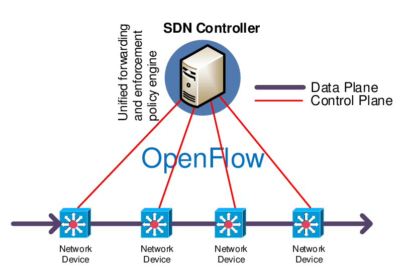
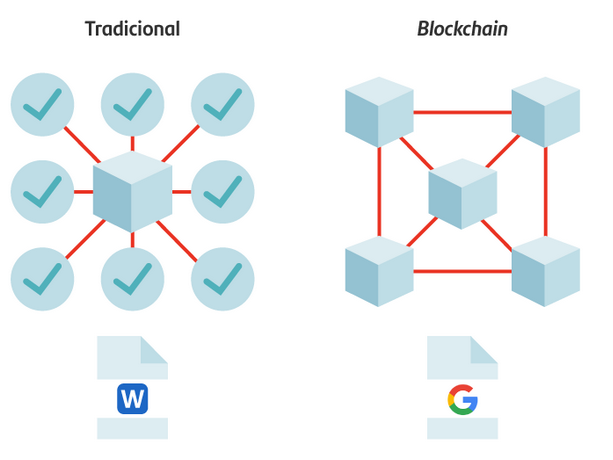

# Infraestructuras críticas, sistemas y aplicaciones: casos reales para la seguridad

infraestructura: Conjunto de elementos, dotaciones o servicios necesarios para el buen funcionamiento de un país, de una ciudad o de una organización cualquiera. [RAE]

La lista de infraestructura critica:

- infraestructura en la nube: componentes fisicos y virtuales que permiten ofrecer servicios en la nube componentes como: centro de datos, servidores, redes software de virtualización, etc.

Pued ser de 2 tipos publica, multiples usuarios pueden compartir una misma infraestructura, privada la infraestructura se dedica a un solo cliente o puede ser hibrida que combina elementos de ambos tipos de infraestructura.

- Redes definidas por software (SDN): Seprara el plano de control(control del trafico de datos ej > enrutamiento) del plano de datos (información) para ejecutarlo en un software centralizo.

- NFV (network Function Virtualization): Virtualizacion de los servicios de red como los enrutadores, firewall, etc atraves de virtualizadores.

- Cadenas de bloques (blockchains): Base de datos compartida y descentralizada en la que cada parte tiene una copia de la base de datos criptograficamente relacionada con los otros blockchains.

Analogía:
Un documento de Microsoft Word solo puede estar abierto por una persona a la vez, de modo que, si se estuviera realizando un trabajo en grupo, se podrían llegar a generar varios documentos de Word que, posteriormente, alguien debería agrupar en una única versión “centralizada”.

En Google Docs, en cambio, varias personas pueden trabajar sobre un documento al mismo tiempo, de manera “distribuida”. Así pueden incorporar cambios y ver en tiempo real las modificaciones que el resto de participantes están haciendo sobre el documento.

- Internet de las cosas (IoT): gestion de todo dispositivo qu pueda cneakl

## Infraestructura en la nube

    La seguridad y la privacidad son las principales preocupaciones para la adopción de la infraestructura en la nube.
    Los desafíos incluyen la seguridad del hipervisor y la protección de datos externalizados.

Problemas de seguridad en la nube:

    La infraestructura de la nube es propiedad y está gobernada por el proveedor.
    La virtualización de servidores aumenta la superficie de ataque.
    Amenazas a múltiples niveles: aplicación, red y sistema operativo.
    Los ataques pueden provenir de otros clientes o del proveedor.
    El multi-arrendamiento puede exponer datos confidenciales.

Preocupaciones de privacidad:

    Los proveedores de la nube tienen acceso a los datos de los clientes.
    Los datos pueden almacenarse en diferentes países con diferentes regulaciones.
    Los clientes pierden el control sobre sus datos.

## SDN (Software Definition Netowork)

Las tecnologías de red han evolucionado hacia la softwarización, con SDN (centralizar el control) y NFV (virtualizar las redes) como paradigmas emergentes. El objetivo es mejorar la flexibilidad y reducir los costos, pero esto conlleva nuevos desafíos de seguridad.

Retos de seguridad:

    Centralización del control: Un controlador central vulnerable puede afectar a toda la red.
    Aumento de la superficie de ataque: Nuevos protocolos y marcos aumentan las vulnerabilidades.
    Acoplamiento entre la red y las aplicaciones: Las aplicaciones pueden afectar la seguridad de la red.
    Configuraciones dinámicas: La verificación de políticas debe tener en cuenta la dinámica de las configuraciones.

## Blockchains

Las cadenas de bloques garantizan la integridad de los datos mediante funciones hash criptográficas. La descentralización elimina la necesidad de una entidad centralizada de confianza. Sin embargo, la seguridad real depende del modelo de gobernanza (centralizado, con permisos o con participación).

Dinámica del protocolo:

- Es crucial que todos los participantes tengan la misma visión de la cadena de bloques.
- Se necesitan mecanismos de consenso para garantizar la coherencia y la seguridad.

Ataques a la red:

- Las cadenas de bloques son vulnerables a ataques de red de bajo nivel.
- La potencia de minería desequilibrada puede permitir ataques como la partición de la red.
- Se necesitan modelos de evaluación de amenazas y contramedidas específicas para cada tecnología blockchain.

Fallos de software:

- Las implementaciones de software de las cadenas de bloques pueden tener errores de programación y vulnerabilidades.
- Estos problemas son más críticos en las aplicaciones que manejan divisas y valores.
- Las aplicaciones de alto nivel deben abordar desafíos como la ejecución simultánea, la distribución y el secreto.

Cadenas de bloques como base para protocolos de nivel superior:

- Las cadenas de bloques pueden servir como base para la ejecución de programas y protocolos de alto nivel.
- Ejemplos incluyen Ethereum y Bitcoin con su concepto de dinero programable.
- El desarrollo de programas y protocolos de alto nivel conlleva los mismos desafíos que el desarrollo de protocolos criptográficos complejos.

Privacidad y anonimato:

- La privacidad no es inherente a las cadenas de bloques sin permisos.
- Existen esfuerzos para garantizar la privacidad mediante pruebas de nulo conocimiento y criptografía avanzada.
- Los requisitos de control y las restricciones legales pueden entrar en conflicto con la privacidad proporcionada por la criptografía.

## Sistemas criticos y ciberfisicos

Son aquellos cuya falla puede tener consecuencias graves como pérdida de vidas, daños a la infraestructura o grandes pérdidas económicas. Deben tener una alta confiabilidad y ser resistentes a ciberataques.

Sistemas Ciberfísicos (CPS):

    Integran componentes físicos y de software que interactúan entre sí y con el mundo físico.
    Suelen ser parte de sistemas críticos y deben ser seguros. Ofrecen una gran superficie de ataque debido a su complejidad y a que son objetivos de alto valor.

Ciberseguridad de los CPS:

    Reutiliza enfoques tradicionales, pero también requiere nuevos métodos para enfrentar su dinamismo.
    La seguridad reactiva y el aprendizaje automático son áreas prometedoras.

## Seguridad de IoT

    La revolución de la IoT está expandiendo la internet a un ritmo acelerado, cambiando la forma en que interactuamos con los dispositivos físicos.
    La seguridad y la privacidad son cruciales en este contexto, ya que las aplicaciones de IoT presentan nuevos desafíos debido a la naturaleza de sus dispositivos con recursos limitados.
    Se necesitan nuevas líneas de investigación para abordar estos desafíos.

Características de la IoT:

    Los dispositivos IoT están integrados con sensores, actuadores, procesamiento, almacenamiento y conectividad para permitir el intercambio de datos. Las aplicaciones de IoT abarcan una amplia gama de dominios, desde la salud hasta la industria.
    La IoT se considera la Cuarta Revolución Industrial debido a su profunda integración del mundo físico en los sistemas informáticos.

Preocupaciones de seguridad y privacidad:

    La falta de seguridad en la IoT puede llevar a ataques cibernéticos y violaciones de datos.
    Un ejemplo es el ataque de la botnet Mirai, que utilizó dispositivos vulnerables para realizar ataques DDoS.
    La privacidad del usuario se ve comprometida cuando las empresas no priorizan la seguridad.

Desafíos de seguridad únicos de la IoT:

    Recursos limitados de los dispositivos: los microcontroladores de la IoT tienen capacidades de almacenamiento y CPU limitadas.
    Naturaleza heterogénea: una aplicación IoT puede incluir código que se ejecuta en clientes web, servidores y dispositivos integrados.
    Gran superficie de ataque: la diversidad de dispositivos y protocolos aumenta las vulnerabilidades potenciales.

Líneas de investigación para la seguridad de la IoT:

    Actualizaciones de software seguras: mecanismos seguros para implementar actualizaciones de software en dispositivos IoT.
    Criptografía ligera y asistida por hardware: técnicas criptográficas eficientes para dispositivos con recursos limitados.
    Seguridad de las tecnologías inalámbricas: abordar los riesgos de seguridad y privacidad de las comunicaciones IoT.
    Políticas de seguridad y privacidad específicas para IoT: diseñar políticas que protejan contra ataques físicos y sus consecuencias.
    Métodos de detección de intrusiones en IoT: técnicas para identificar y detener malware y otros ataques en redes IoT.
    Lenguajes de programación y compiladores seguros para aplicaciones IoT: lenguajes y marcos de trabajo que consideren la seguridad y la privacidad desde el diseño.
    Protocolos de autenticación específicos: protocolos que brinden autenticación segura y respetuosa con la privacidad para usuarios y dispositivos IoT.

## Seguridad industrial

La ciberseguridad de los sistemas industriales y la robótica es un tema crucial debido a las graves consecuencias que puede tener un ataque.
Los sistemas industriales y los robots conectados son cada vez más comunes, lo que aumenta la superficie de ataque.
Es necesario desarrollar nuevas soluciones de seguridad para proteger estos sistemas.

Desafíos de seguridad en sistemas industriales:

    Los protocolos utilizados no son seguros.
    Las especificaciones de los protocolos no siempre están disponibles públicamente.
    Los dispositivos tienen recursos limitados.
    Los sistemas son cada vez más interconectados.

Soluciones de seguridad para sistemas industriales:

    Actualizaciones de software seguras.
    Criptografía ligera y asistida por hardware.
    Seguridad de las tecnologías inalámbricas.
    Políticas de seguridad y privacidad específicas para la industria.
    Métodos de detección de intrusiones para ICS.
    Lenguajes de programación y compiladores seguros para aplicaciones ICS.
    Protocolos de autenticación específicos.

Áreas críticas de aplicación:

    Medicina: los datos médicos son sensibles y los ataques a los equipos médicos podrían poner en peligro la vida de las personas.
    Robótica y vehículos autónomos conectados: los robots y vehículos conectados pueden ser utilizados para causar daños físicos o interrumpir infraestructuras críticas.

## Tecnoogías basadas en aprendizaje automatico

Aprendizaje Automático

Introducción:

    El aprendizaje automático (ML) se está utilizando cada vez más en una amplia gama de aplicaciones.
    El ML presenta dos vulnerabilidades principales de seguridad: el aprendizaje automático adverso y las preocupaciones de privacidad.
    El aprendizaje automático adverso implica engañar a los modelos de ML con entradas cuidadosamente diseñadas para engañar al modelo de ML y realizar acciones no deseadas.
    Las preocupaciones de privacidad se refieren a la posibilidad de que los datos de entrenamiento se infieran a partir de un modelo de ML.

Aprendizaje automático adverso:

    Los ejemplos adversarios son entradas cuidadosamente diseñadas que pueden engañar a los modelos de ML.
    Los ejemplos adversarios pueden ser difíciles de detectar para los humanos.
    Los ejemplos adversarios pueden tener graves consecuencias, como el mal funcionamiento de los coches autónomos.
 
Investigación de Inria sobre el aprendizaje automático adverso:

    Inria está investigando métodos para mejorar la robustez de los modelos de ML frente a los ataques adversarios.
    Un enfoque es desarrollar métodos para detectar ejemplos adversarios.
    Otro enfoque es desarrollar métodos para hacer que los modelos de ML sean menos sensibles a los ejemplos adversarios.

Privacidad en el aprendizaje automático:

    El entrenamiento de modelos de ML puede implicar el uso de datos sensibles.
    Es importante proteger la privacidad de los datos de entrenamiento.
    Inria está investigando métodos para entrenar modelos de ML de forma privada.
    Un enfoque es utilizar técnicas de privacidad diferencial.
    Otro enfoque es utilizar el aprendizaje federado.

