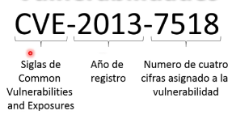

# Pentesting

Identificar informacion especifica de un SO a ser atacado.

Etapas 

- Id objetivo: conocer el SO presente o dirección IP. 
- Buscar exploits: [Nessus - escaneo y clasificación de exploits], con esa información llega

- Planificación del ataque: ejemplo de nomenclatura CVE-2013-7518 

ataques:

con framework:

metasploit: bibliotecas llenas de herramientas.
exploits: codigo que se aprovecha de algun tipo de vulnerabilidad del objetivo.
payloads: carga util exploits que permite realizar una acción, secuencias de codigo que se ejecuta y esta diseñada para realizar la acción final.
hydra: 

- Mantener el acceso

netcat: 
meterpreter: establecer comunicaciones remotas

limpieza

reporte

Como documentar

finalemnte realizar un hardering.- mejorar los sistemas de seguridad, reduciendo la superficie de ataque de esta forma mitigando el riesgo de vulneravilidades.

superficie de ataque: caminios posibles que los ciberdelincuentes pueden usar para realizar una accion que comprometan los recursos.

tipos de hardering

SO
politicas de seguridad 
firewall
app de parches y actualizacion de seguridad

Aplicaciones
autenticacion segura
parametros por defect
criptografia
tokens

red
protocolos seguros
actualizacion del firmware
accesibilidad logica y fisica
monitoreo de trafico   

SErvidores

descativar servicios no utilizados
Roles de ususarioaplicacion de parches y actualización de seguridad

Bases de datos

autenticacion 
cifrado
autorización

